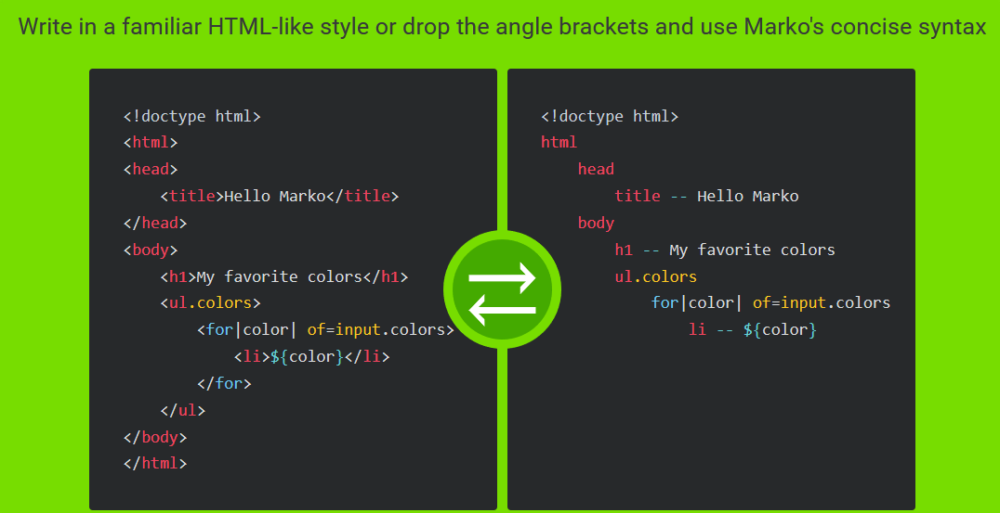

# Advanced Frontend Development for (real and) experienced developers 

Previously I outlined beginner backend development in article (here:  https://github.com/INTUITION-dev/httpRPC/tree/master/other/doc  )
And now here in part 2, I'll tackle how to effectively do Frontend development: targeting experienced developers, 7+ years of professional
web development. The 7 years being based on book called: 10K hours to mastery. 
What I am saying to the reader is if you are a jr Frontend developer this article is not for  you, ( but you can likely do beginner backend development as linked at the top - it is much easier to start and master backend - and while doing backend you can get exposed to non-imperative styles of programing, for example using SQL is declarative.)

Some of the concepts I introduce may seem strange at first, a bit like eating sushi the first time. But then, you end up developing a taste for it.


### How do real developers develop UI/Frontend?

When C and C++ developers need GUI the use GUI libs and some of the modern libs they use are declarative:
- Qt/QML
- sciter
- ultralig.ht
- CEF

( Some of the older C/C++ GUI lib like wx, Haxe and GTK are imperative)

Above libs for C/C++ GUI are HTML / DOM based. Html is really a tree/graph of elements.

### SEO (and AMP)

Some apps are secure, but others need to be viral enabled - so we optimize for SEO. Google, Bing and others offer
webmaster / search console tools online - where you can check your page/screen's performance. 
What you have to have resized years ago: you can't use .js client side for anything SEO!

And for improved mobile SEO you may need to render AMP. Again: no .js.

Just HTML and CSS.
You should get the idea that imperative development is mostly for backend and beginners. Imperative is not for advanced and not for Frontend.

## Real Frontend development and tooling

JAMStack architecture talks about *' prerendered Markup, served without web servers '*. Nice thing about pre-rendered is: SEO :-). No need to dynamically render. No web servers also means fast, served by the edge (CDN) and infinitely scalable. ( Infinitely scalable of the Frontend; the backend APIs is a different team ).

I highly recommend that all FE developers have a github page! 

## Mark up

eBay uses Marko for markup, eg:



Nodejs Express uses the more popular Pug for Markup, and most people are familiar with it:
- https://expressjs.com/en/guide/using-template-engines.html

#### So how do we pre-render? 

You bind data at compile time for anything SEO. You can compile markup(template) with Grunt|Gulp, but after running into limitations
of the build languages, it is much easier to write a build script in .js, and have full access to npm packages for your build script. You likely already know .js, but this time you are running it at compile time to generate screens/pages that will run statically.

One popular tool as an alternative to a build script is Prepros.io. You can for example compile SASS to .css, Pug to html and .ts to .js.
You are likely already familiar with compiling Sass to CSS as it gives you more power. The JAMstack approach does the same thing with html.

With a generate for example you can reuse snipets, use same markup for SEO|AMP-no.js screen page, and an enhanced  SPA version with client side .js of the same page (on first user click). 


#### Static / Dynamic?

An example JAMstack is both static and dynamic: show a story static without need for .js! Then progressively enhance to display comments dynamically and improve UX. 


## Cross Platform: Electron

Responsive approach allow us to develop a web app that works on desktop and mobile screens. 
One important tool to master is Electron. It allows a path to cross platform development.

For example: IOS and Android running the same exact code base that is running your Web App.
But it should be done in two steps:
1. Port your app to Electron 
2. Port the Electron app to Adobe PhoneGap at build.phonegap.com.


### Custom Elements

Lets write a standard (built into browser with no 3rd party libs) custom element:

```
    var cTemp = document.createElement('template')
    cTemp.innerHTML = `
    <style>
    </style>

    <b>I'm a Cust. El</b>
    `
    customElements.define('c-custel', class extends HTMLElement {
    sr 
    constructor() {
        super()

        this.sr = this.attachShadow({ mode: 'closed' })
        this.sr.appendChild(cTemp.content.cloneNode(true))
    }//cons

    })//define
```

That code creates a new dom element: c-custel without any 3rd party libs or packs. 

The purpose of writing imperative (.js) is to: add a new DOM element c-custel. 
The purpose is: to reduce .js code! And increase DOM code.
Make sure you have purpose in mind. 

The nice thing about using standard custom elements is that you can use them with any .js framework|library (eg: Vue single file components), with typescript. 
And you can deliver in several shareable bundles to avoid downloading a large monolithic bundle.


### Lab: Non-imperative

To get the feel for non-imperative programing you should write a hello world levering in Mavo.io.
Mavo is developed by Lea Verou who is on the HTML standards committee.

Note: I'm not recommending or using Mavo. I am saying it is a great learning tool that takes less than an hour so you can feel an important concept.

Instead of html, use Pug (eg: Prepros.io). 

1. A hello world Mavo in Pug, the simpler the better (instructor provided)
2. Port to Electron (instructor provided)
3. Port to build.PhoneGap

Email the app file produced by build.PhoneGap to your phone. 


## Frontend (CSS) frameworks, and naming.
 
Here is a video showing some results when you google for Frontend frameworks:

<a href="http://www.youtube.com/watch?feature=player_embedded&v=Jpr2RvAQtm8" target="_blank"></a>

So to be clear, we should delineate Frontend CSS frameworks that include .js and Frontend .js only frameworks.

Senior Frontend Developer should have experience with a more than one Frontend CSS frameworks as well as migrating from one to another. 

Note: above all, a Senior Frontend developers has years of experience and depp knowledge of CSS. 

Note: there are two things hard in CS. Caching(backend) and naming. Naming DOM and 'classes' is hard.
One bad thing is to use inline styles, for example the 'atomic' approach.

That is the main challenge for Sr. Frontend developers: naming. The names have to be socialized and rehashed from time to time. 
One thing that might 
It's not just rapid development of front end prototypes - the aim is maintainable naming.

### Mobile org chart

Obviously having a separate mobile team doing Android and IOs will obstruct cross platform productivity: DRY.

Instead the frontend team's teach leads are broken up by the users persona, the people your org is targeting in helping. 

(aside: each frontend team should have a single member from the backend team that is writing the client side apis for them - APIs that map to the ViewModel)

Some call the Senior Frontend developers unicorns: designers that code. That is one of the reasons that the frontend is a higher salary band than backend.
Also due to constraints, Senior Frontend developers maybe remote or at least have a Friday WAH (work from home), (vs backend that likely have to be local due to security of backend data).

Candidates Senior Frontend developers should have some example sites, including their own, and opinion on css websites they like and other other sr Frontend developers they admire. (note: If the people they admire are .js or imperative developers I myself would consider them for the backend team)
And they must demonstrate a liking for CSS.

The Frontend developers tend to be more senior than backend: and should have potential to become principal Developers, designers or product managers once they advance.

One should also know how long it takes to build an average CRUD page. 

### Low-code future

There are also low-code tools that are coming up in the future, something to keep an eye one.

## Summary:

Sr Frontend developers must have deep expertise in CSS, SEO and know cross platform development.

Skills include:
- Markup, declarative and CSS
- Good 'class' naming is the bane of front end development
- Mobile is cross platform
- Custom elements can be used with any .js lib, it is built into the browser


