<!-- $theme: default -->
<!-- prerender: true -->
<!-- page_number: true -->
<!-- $size: 16:9 -->
<!-- footer: Metabake.net -->
# Primates uses a box to reach

---
## Automatic generation of apps examples:

|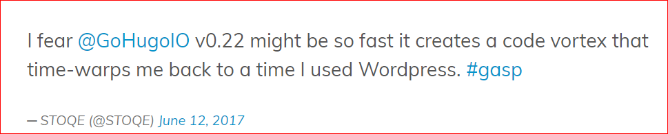|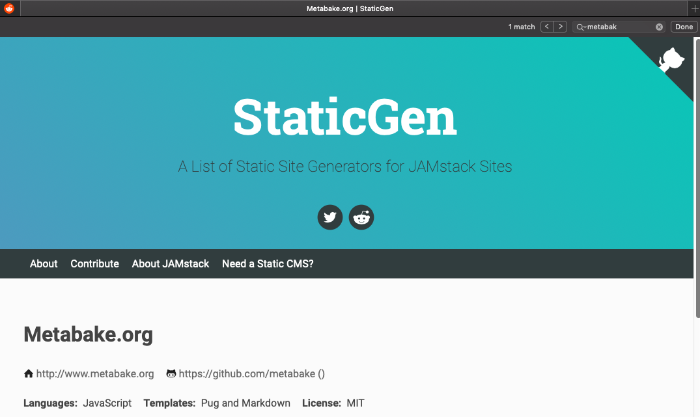|
|:-:|:-:|
---

Pillar 1: A specific remote centric Agile management (SFT)
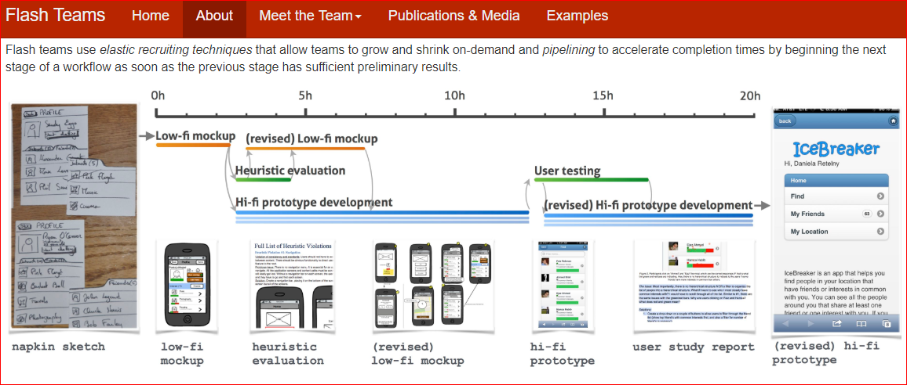
- Can someone read the time scale on top?
---

Management, take a screen shot every few minutes
|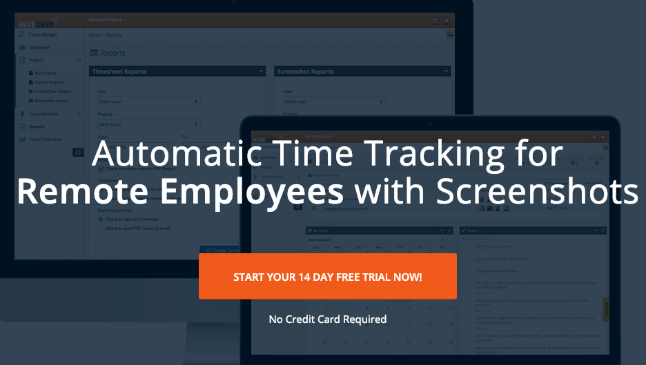||
|:-:|:-:|
---

## Employee cost? !!
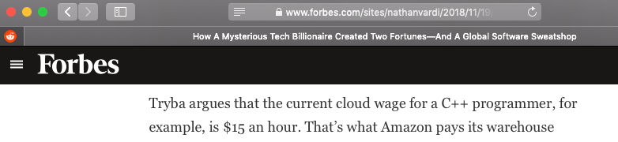

---

### Pillar 2: UX oriented. Less bits and bytes.
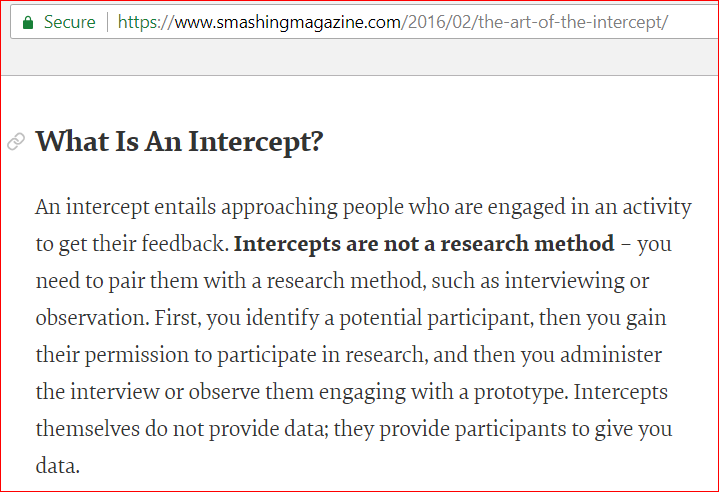

---

## Pillar 3: Admin/auto gen app

---

### Pillar 4: Team, includes designers. Less bits and bytes(again).

---

## Designs, mockups and prototypes done in code
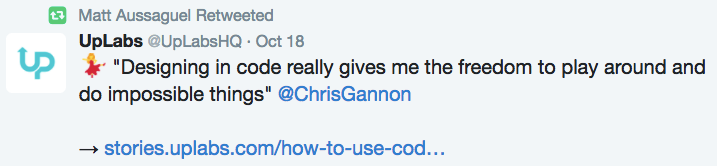
Reduce # of tools

---

## eBay: Declarative, auto-close 
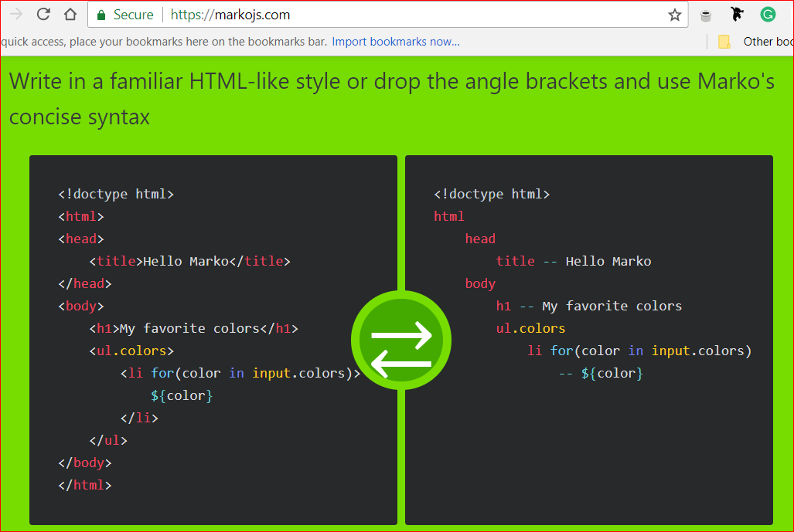
Q: What is a popular declarative markup? (hint: used by a node library )

---

## Pillar 5: Able to learn quickly
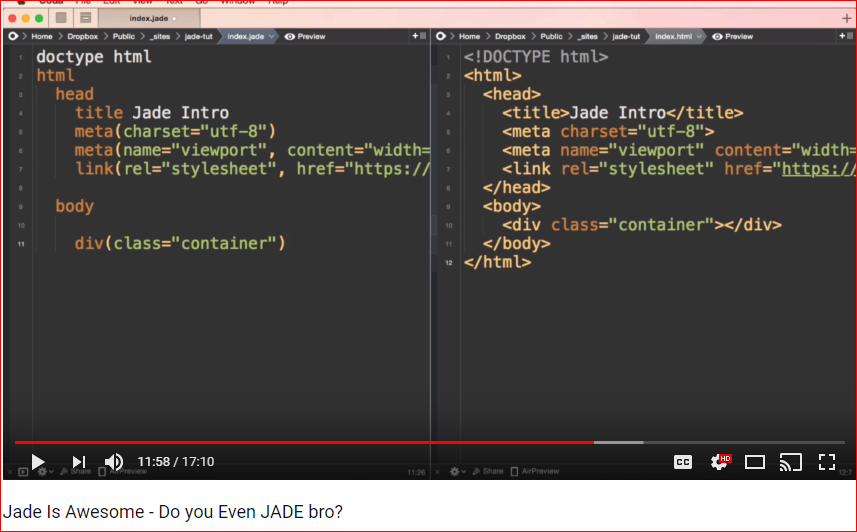
Pug generator works same in Node, PHP, Go, Python, etc. 

---

## Pillar 6: SEO
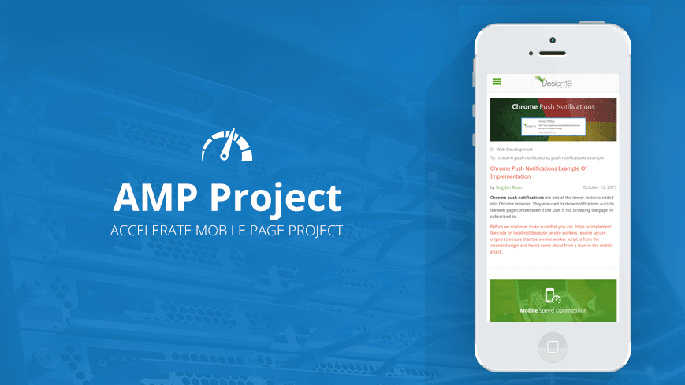
Static

---

## Pillar 7: DRY 
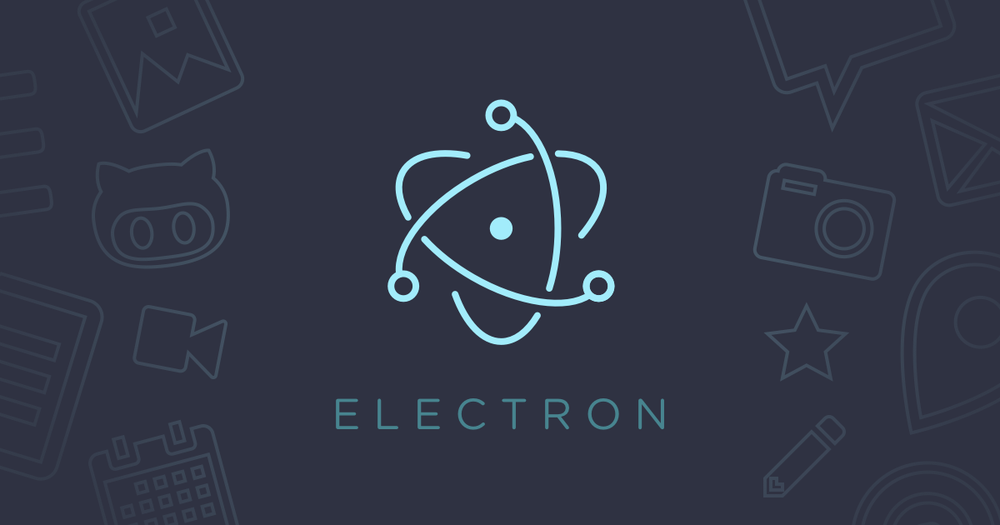
Hybrid

---

### Slow?
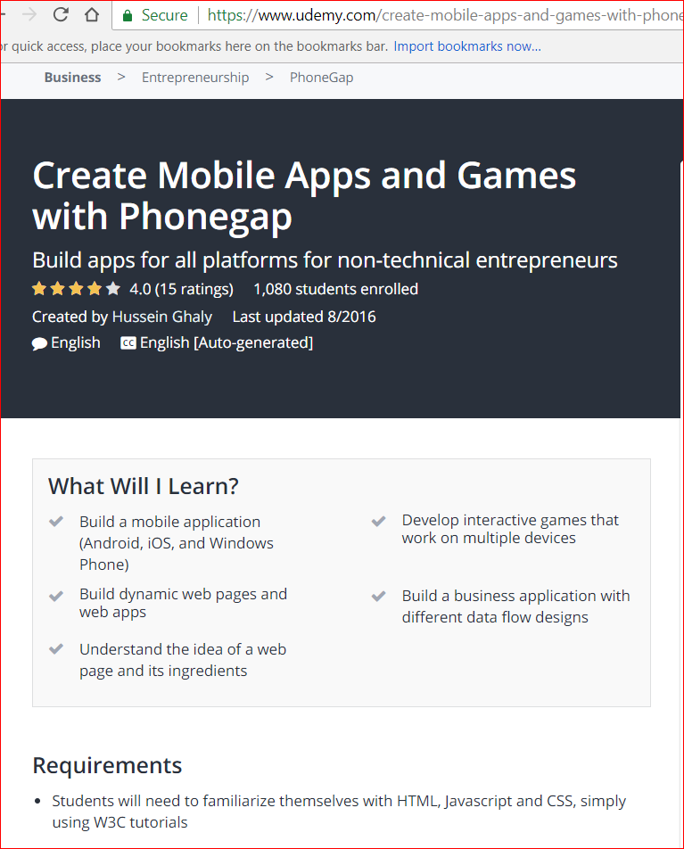
No need to install Swift or Kotlin or any SDK - transpile is done **in the Cloud** by Adobe: for FREE

---

## Cloud: v2
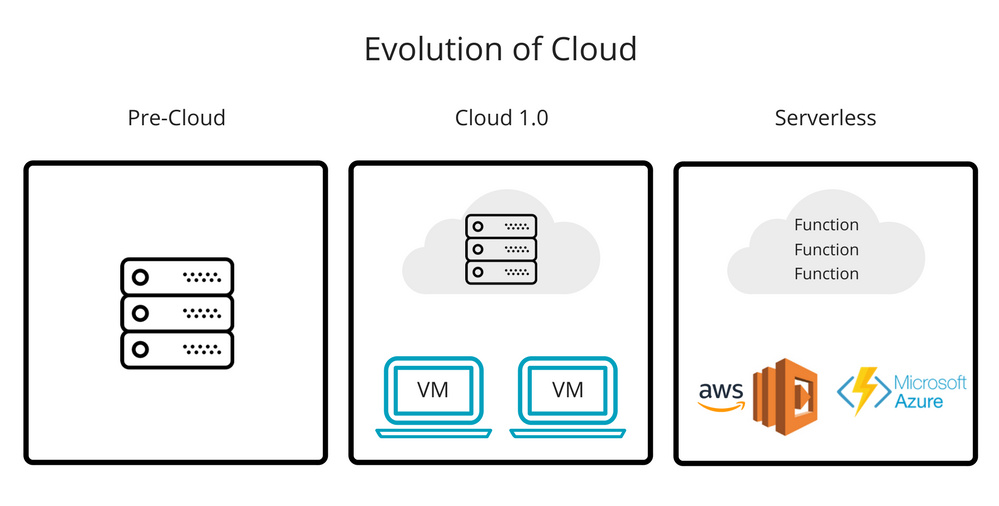

---

## Pillar 8: Cloud v2
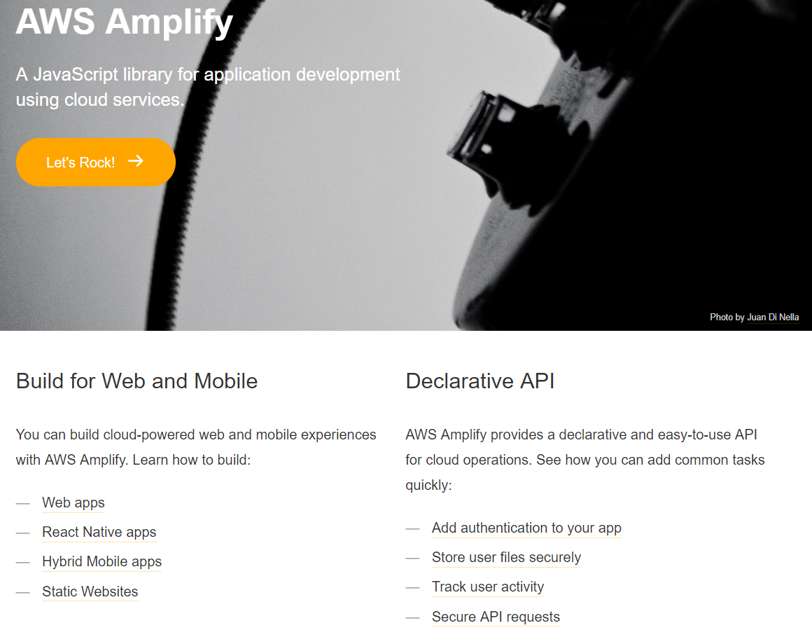
or better then AWS: Google FireStore v2. CRUD.  Auth. Done for you. 

---
... CDN. Faster and cheaper. 

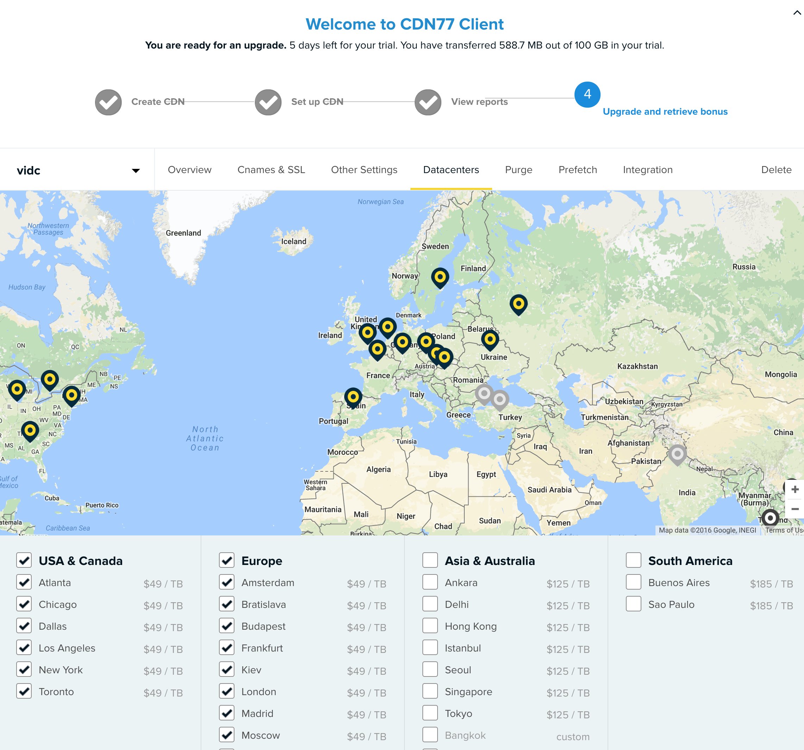

---

# Q: In software, what do **you think** is cheaper, left side or right side?
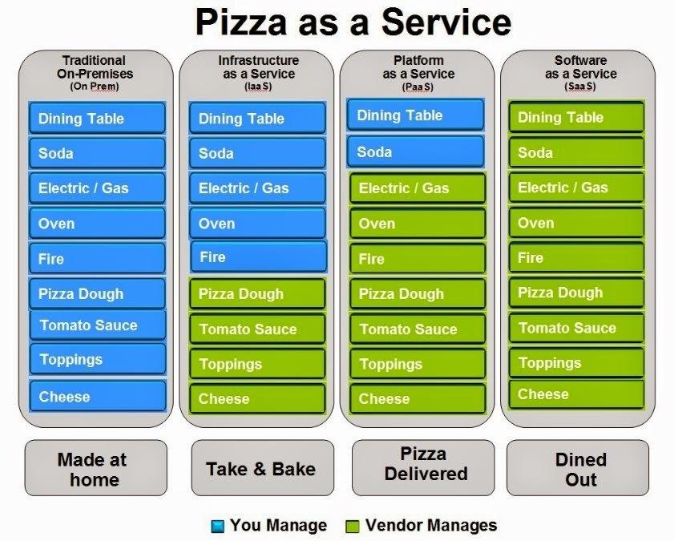

---

PC in the cloud

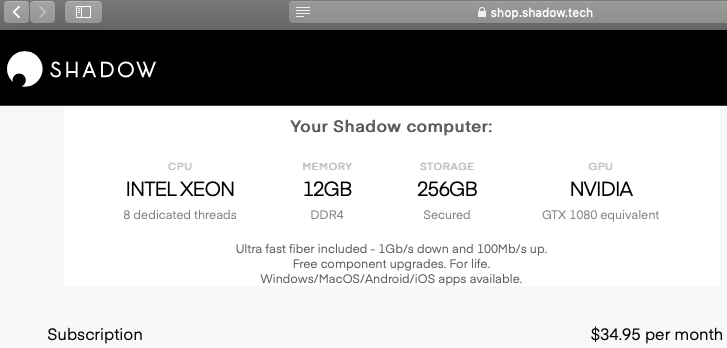

---

## Pillar 9: Security. eg WebIDE. (Clientless)
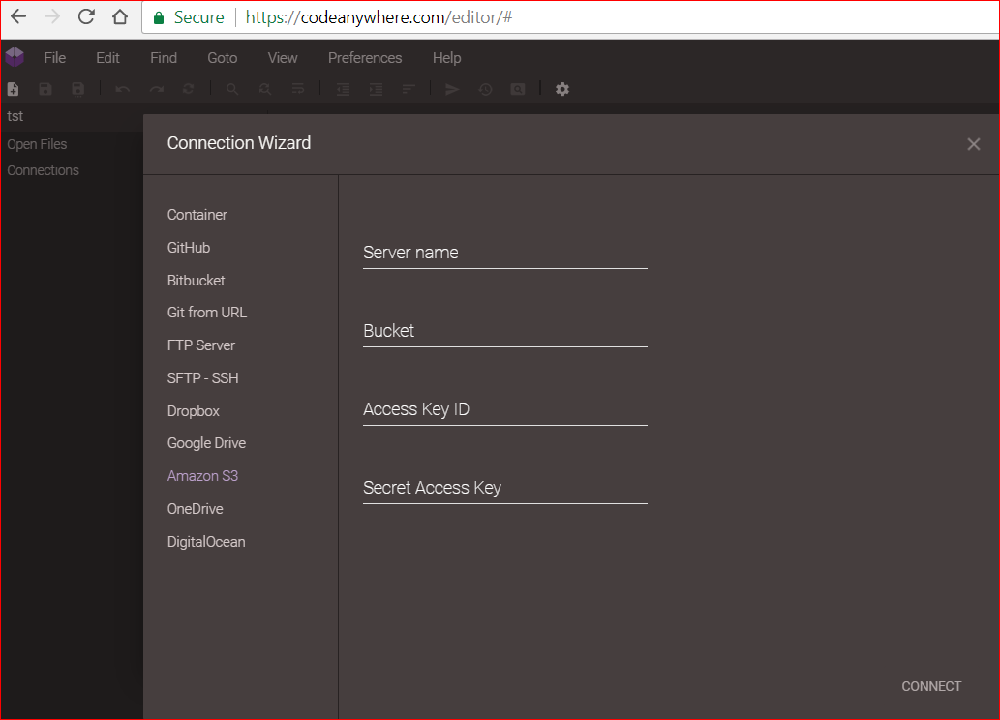

---

# Pillar 10: Benchmark
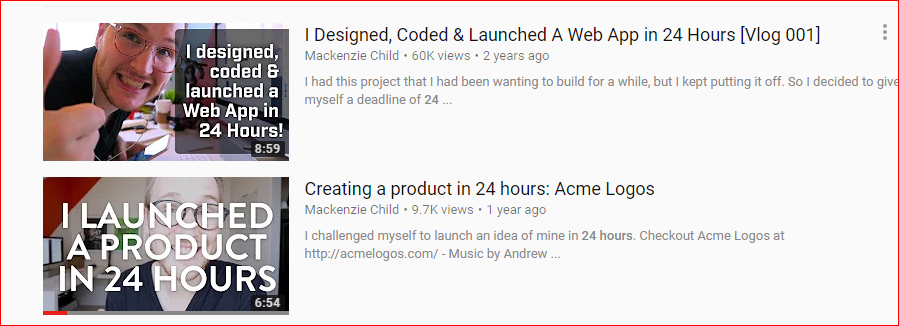
Maybe... compare your productivity.

---

I did nothing at my first 'Black Swan'

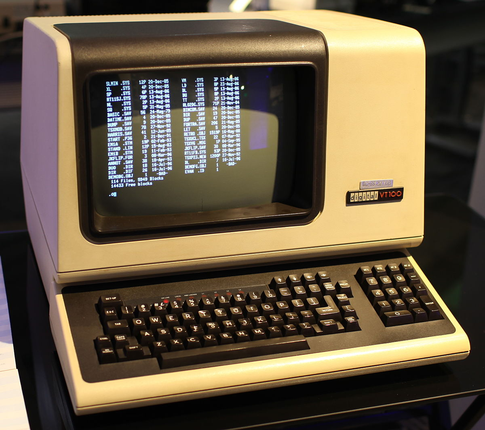

----

## Productivity could be used for story telling!

for slides, video, 'paper' 
www.Metabake.net
or vic@metabake.org 

- else github, npmjs, staticgen.com

